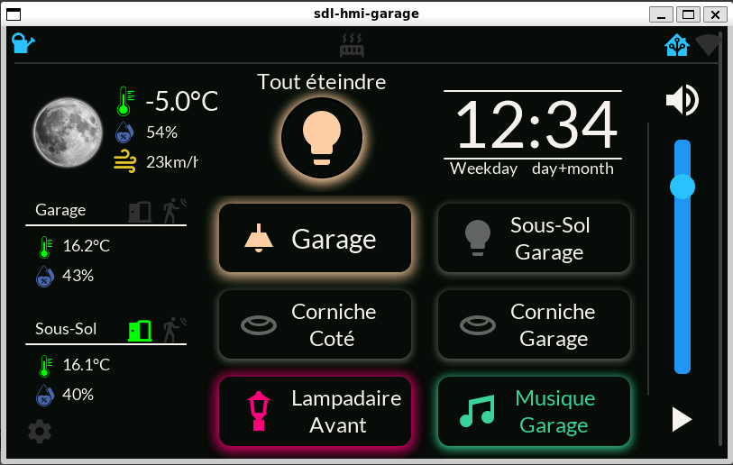
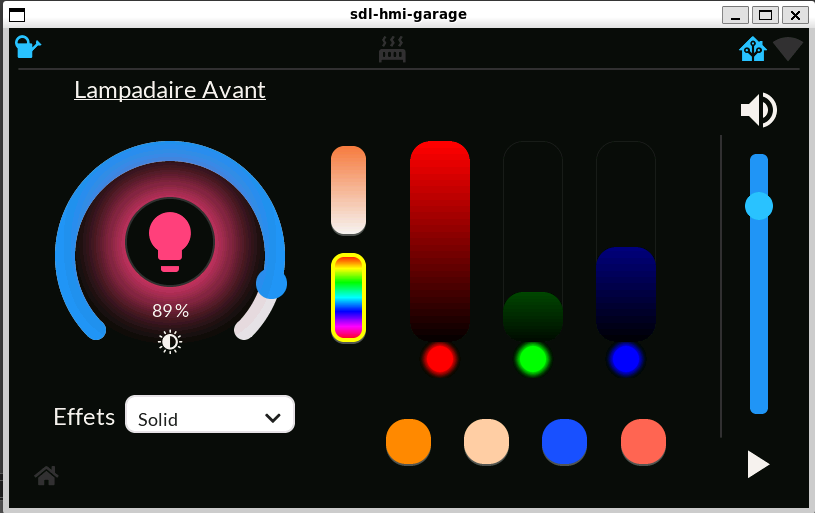
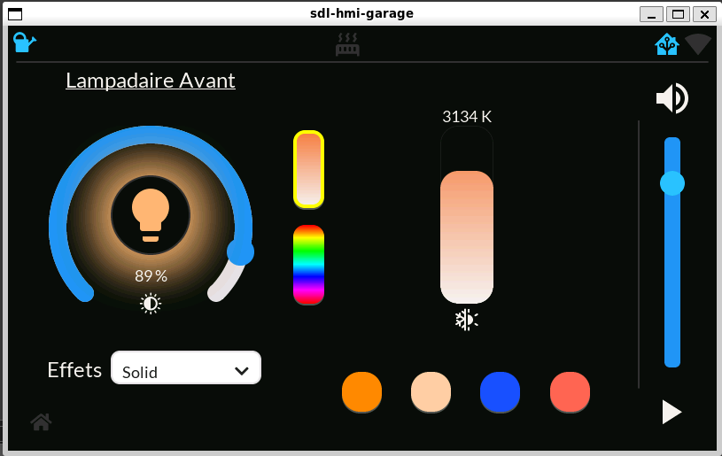
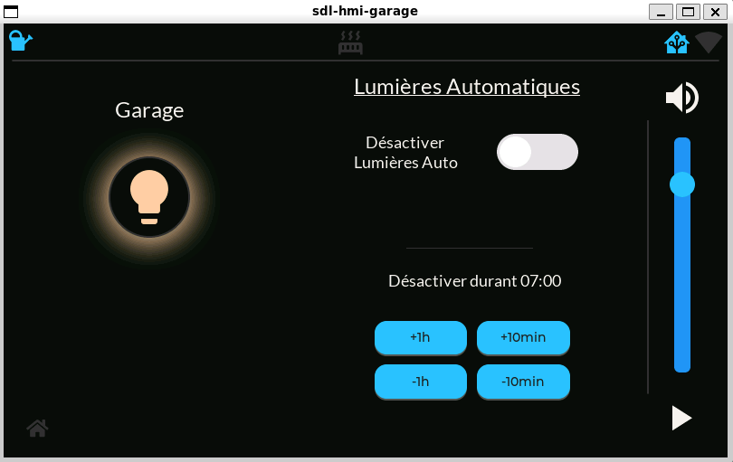
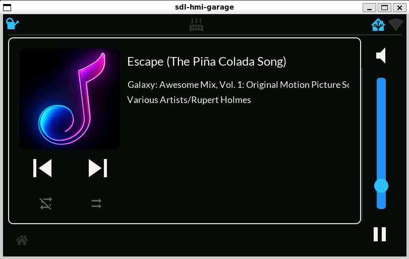

# ESP32-S3-Touch-LCD-7 ESPHOME LVGL HMI

HMI developped through ESPHome's framework with heavy use of lvgl.

Used to display sensor data and control lights through Home Assistant. All for devices relevant to the area where this device is installed in my house. In my garage.



This project is very much tailored to my needs but could serve as a base for anyone willing to do something similar.

This HMI is used to:

- Display local weather data
- Display indoor temperature/humidity for Garage and garage's basement.
- Display access doors open/closed status for doors going to house's ground floor and basement
- Control lights around the garage's area. Indoor and outdoor.
- Display a couple notification icons. If plant needs watering, front or back door opened, etc.
- Display API connection status to Home Assistant.
- Display wifi signal strength.
- Shows a contextual button to turn off all lights. Useful when leaving the house.
- Control Music volume/mute and play/pause status.
- Sub page to control RGBCT lights. Switch between color_temp and rgb mode. Activate effects, pick color/temperature. WIP.
- Sub page to override light automations, with configurable timeout.
- Sub page for music control. Skip next/previous tracks. Media info. More to come. WIP.










## Notes on project

This is still very much in active development. In fact, I will be submitting Pull Requests to ESPHome's main repo to further increase functionnality in LVGL's component.

Things are subject to change.

As it stands now, the standard flash partition size is almost full. 

```
Flash: [==========]  99.6% (used 3915053 bytes from 3932160 bytes)
```

As the Waveshare's ESP32-S3-Touch-LCD-7 uses a 8MB flash WROOM module, you get a little under 4MB of flash space for your program following standard ESPHome's standard partition scheme.

This project could benefit from optimization but I'm not an expert in the matter.

If it comes to it, there is a way to forgo standard partition scheme and use most of the 8MB flash space for the entire program. The drawback is losing the ability to do OTAs. Then it becomes necessary to update the device through it's uart. There is a way to connect a second ESPHome device to the uart and use a custom "ser2net" component to pipe a serial interface over wifi. It then becomes possible to flash the device using esptool programming tool to perform a sort of OTA but with more manual steps involved. More to come on this.

For the time being, this project still fits in the standard partition scheme.

## Notes on development

This project is split into multiple files. Usage of an IDE like Visual Studio Code is strongly recommended.

There is a secondary ESPHome project using SDL2 platform to test changes made in LVGL instead of flashing over and over a real device. 

This requires [manually installing ESPHome](https://esphome.io/guides/installing_esphome.html) as well as a few other dependencies.
More info on how to setup a dev environnement on your PC is coming. In the meantime, check out this forum thread: https://community.home-assistant.io/t/how-to-virtual-esphome-device-and-development-using-windows-work-in-progress/802669/2


## Thanks

For getting me started and for animated weather effects
https://github.com/alaltitov/display/tree/main